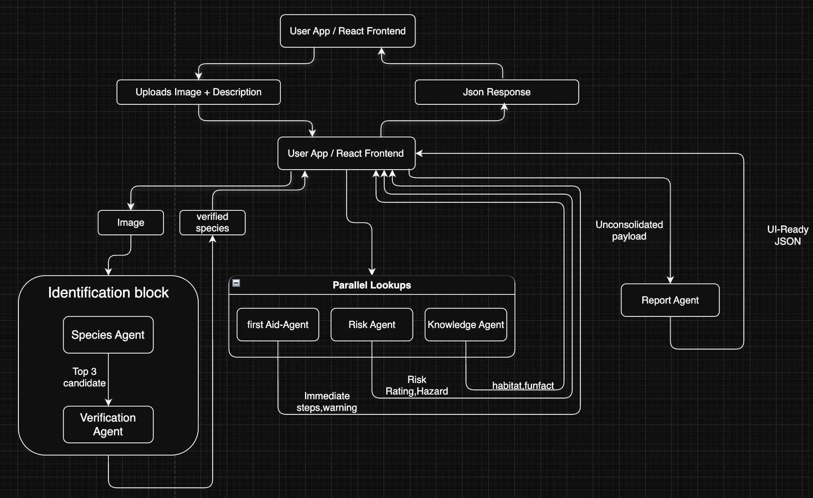
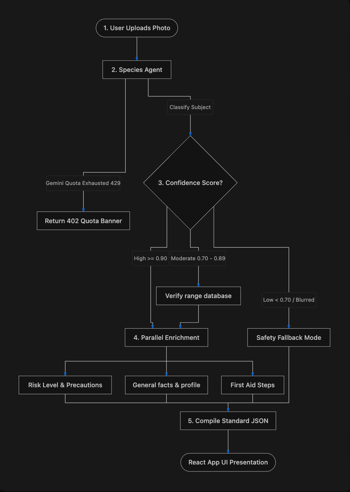
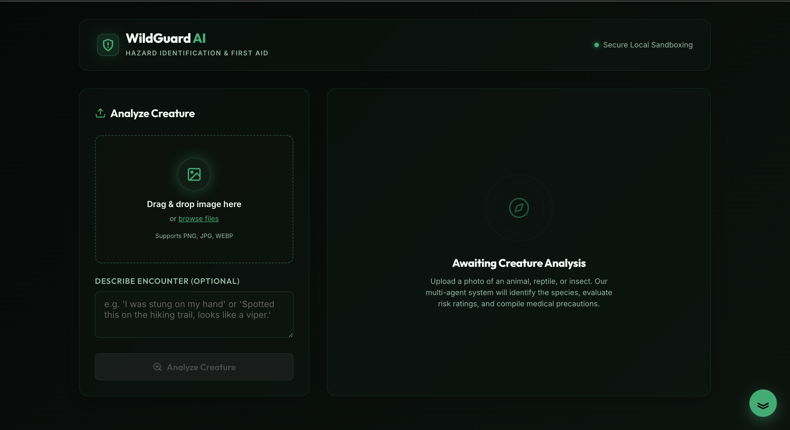
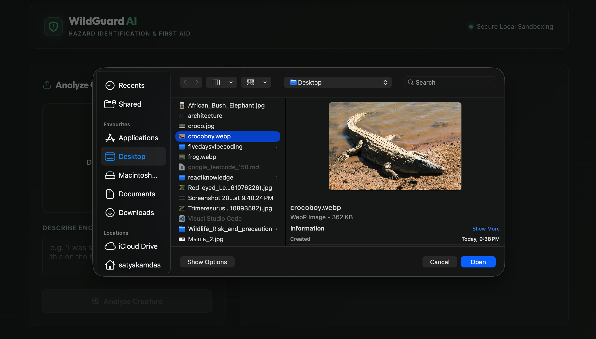
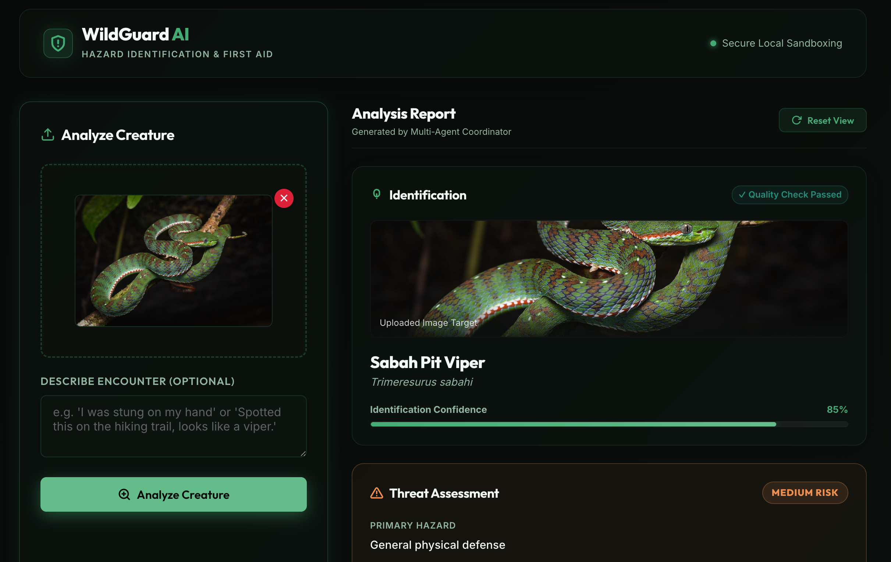
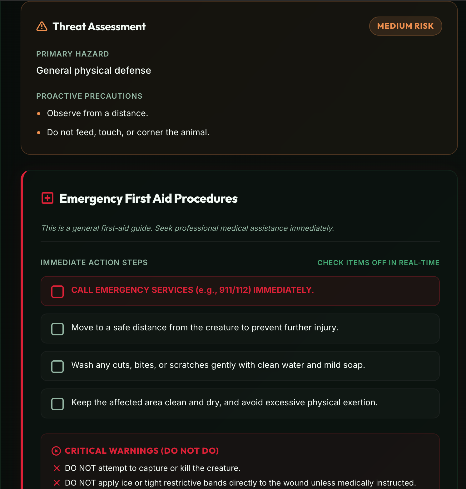
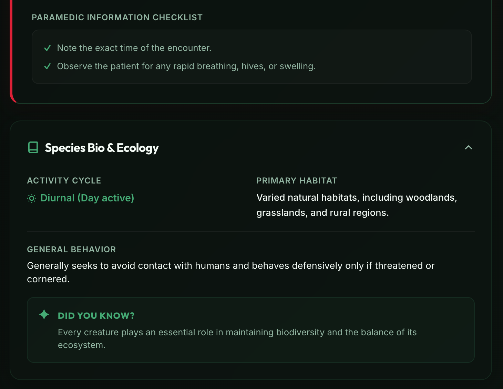

# 🛡️ WildGuard AI

AI-powered multi-agent wildlife identification and safety assistant built using Google ADK, Antigravity 2.0, Django, React, and the Gemini API.


## Problem Statement

Every year, people encounter unfamiliar wildlife while hiking, farming, camping, or traveling. Misidentification or delayed access to reliable safety information can result in dangerous situations.

WildGuard AI assists users by identifying wildlife from uploaded images, assessing potential hazards, providing emergency first-aid guidance, and educating users about the detected species through a coordinated multi-agent AI system.


## Solution Overview

WildGuard AI is a full-stack multi-agent application that analyzes uploaded wildlife images using Google's Gemini API.

Instead of relying on a single AI agent, the system decomposes the workflow into specialized agents responsible for:

- Species Identification
- Geographic Verification
- Risk Assessment
- First Aid Generation
- Ecological Knowledge
- Report Generation

An orchestrator coordinates these agents to generate a structured wildlife safety report.


# Why a Multi-Agent Architecture?

Wildlife identification involves multiple independent tasks, including image recognition, geographic validation, risk assessment, first-aid generation, and educational reporting. Rather than relying on a single general-purpose agent, WildGuard AI distributes these responsibilities across specialized agents coordinated by an Orchestrator Agent.

This approach improves modularity, simplifies maintenance, enables independent testing of each component, and produces a more structured and explainable analysis pipeline.
---

# Features

- Wildlife image upload
- AI-powered species identification
- Image quality validation
- Geographic verification
- Risk assessment
- Emergency first-aid recommendations
- Ecological information
- Structured safety report
- Local database caching
- Modern React dashboard


# Multi-Agent Architecture




## explanation

The application follows a multi-agent architecture coordinated by a central **Orchestrator Agent**. Instead of assigning every task to a single AI model, the orchestrator delegates responsibilities to specialized agents, each designed to solve a specific part of the wildlife analysis process.

1. **Species Agent** analyzes the uploaded image and identifies the most likely wildlife species.
2. **Verification Agent** validates whether the identified species is geographically plausible using the user's location and available reference data.
3. **Risk Agent** evaluates the potential danger posed by the identified species and determines an appropriate risk level.
4. **First Aid Agent** generates emergency first-aid recommendations for bites, stings, venom exposure, or other possible encounters.
5. **Knowledge Agent** provides educational information such as habitat, behavior, ecological importance, and interesting facts about the species.
6. **Report Agent** combines the outputs from all agents into a structured wildlife safety report that is returned to the frontend.

This modular design improves maintainability, allows individual agents to be updated independently, and enables more reliable reasoning by separating complex tasks into specialized components.

# Requirements

- Python 3.11+
- Node.js 18+
- npm
- Google Gemini API Key

# Technology Stack

## Frontend

- React
- Vite
- JavaScript
- CSS

## Backend

- Django
- Python

## AI

- Google Gemini API
- Google ADK
- Antigravity 2.0

## Database

- SQLite

## Libraries

- Pydantic
- Pillow

---

# Agent Skills

This project demonstrates Agent Skills through dedicated skill definitions for:

- Backend
- Frontend
- Database
- AI/ML

---

# Project Structure

```text
Wildlife_Risk_and_precaution/
│
├── .agents/
│   ├── agents/
│   │   ├── orchestrator_agent/
│   │   ├── species_agent/
│   │   ├── verification_agent/
│   │   ├── risk_agent/
│   │   ├── first_aid_agent/
│   │   ├── knowledge_agent/
│   │   └── report_agent/
│   │
│   └── skills/
│       ├── ai_ml/
│       ├── backend/
│       ├── database/
│       └── frontend/
│
├── backend/
│   ├── analyzer/
│   │   ├── agents/
│   │   ├── mock_data/
│   │   ├── models.py
│   │   ├── views.py
│   │   ├── serializers.py
│   │   └── urls.py
│   │
│   ├── config/
│   ├── manage.py
│   └── requirements.txt
│
├── frontend/
│   ├── src/
│   ├── public/
│   ├── package.json
│   └── vite.config.js
│
├── README.md
└── .gitignore
```

---

# Workflow



## explanation

The wildlife analysis process consists of the following steps:

1. The user uploads a wildlife image through the React frontend.
2. The image is sent to the Django backend via the REST API.
3. The Orchestrator Agent receives the request and coordinates the analysis.
4. The Species Agent identifies the animal using the Gemini API.
5. The Verification Agent checks whether the prediction is consistent with the provided geographic information.
6. The Risk Agent evaluates the potential threat level of the identified species.
7. The First Aid Agent generates emergency guidance when necessary.
8. The Knowledge Agent gathers ecological and educational information about the species.
9. The Report Agent merges all results into a structured safety report.
10. The backend returns the completed report to the frontend, where it is displayed in an interactive dashboard.


## Backend

```bash
cd backend

python -m venv .venv

source .venv/bin/activate
```

Windows

```bash
.venv\Scripts\activate
```

Install dependencies

```bash
pip install -r requirements.txt
```

Create your environment file

```bash
cp .env.example .env
```

Add your own Gemini API key inside `.env`.

Run migrations

```bash
python manage.py migrate
```

Start the backend

```bash
python manage.py runserver
```

---

## Frontend

```bash
cd frontend

npm install

npm run dev
```

---

# Environment Variables

Create a `.env` file inside the backend directory.

Example:

```env
GOOGLE_API_KEY=your_api_key

SECRET_KEY=your_django_secret_key

DEBUG=True
```

---

# Screenshots

## Home



## Upload



## Analysis Dashboard




---

# Future Improvements

- Offline wildlife classification models
- GPS-aware geographic validation
- Support for additional wildlife datasets
- Mobile application
- Multi-language support
- Conservation reporting integration

---

# Acknowledgements

This project was developed using:

- Google ADK
- Antigravity 2.0
- Google Gemini API
- Django
- React
- Vite
- Pydantic
- Pillow

---

# Disclaimer

WildGuard AI is intended for educational and research purposes. Wildlife identification and first-aid guidance generated by AI should not replace professional medical advice or assistance from wildlife experts in emergency situations.